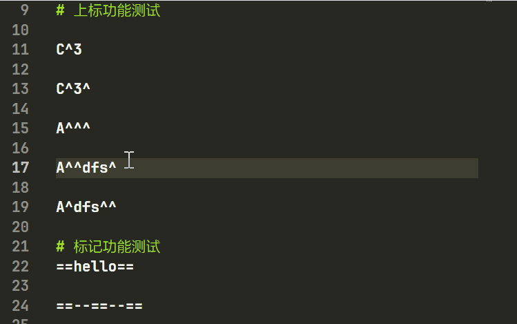

# **markdown dialect format**


<div>
<br>
<a href="https://github.com/zomaii"></a>&nbsp;
<a href="https://github.com/ZoMaii/md-maic/tree/main"></a>&nbsp;
<a href="https://github.com/ZoMaii/md-maic/tree/develop"></a>&nbsp;
<a href="https://www.typescriptlang.org/"></a>&nbsp;
</div>

> &#x1F917; open-source on [GitHub](https://github.com/ZoMaii/md-maic)! | &#x1F3AF; edit file by VSCode(TS/JSON)


# 📏 Formatting markdown dialect

Formatting selected Text by key:<kbd>Ctrl</kbd> + <kbd>Shfit</kbd> + <kbd>A</kbd>

`H~2~o` => H<sub>2</sub>O<br>
`E=mc^2` => E=mc<sup>2</sup><br>
`==hello==` => <mark>hello</mark><br>
`redtext::&red::` => <font color='red'>redtext</font><br>
`warning::#FFD700::`=> <font color='#FFD700'>warning</font><br>
`日本語::!にほんご::` => <ruby>日本語<rt>にほんご</rt></ruby><br>
`MS::mircosoft::` => <font title='mircosoft'>MS</font>


# 📐 Multi-line formatting
<kbd>Alt</kbd> + <kbd> MOUSE </kbd> to select line,and then <kbd>Ctrl</kbd> + <kbd>Shift</kbd> + <kbd>P</kbd> to select `md-maic.*`




# 🗺️ Multi-language support

We provide multi-language support, you just need to add your language in the `conf/lang/` folder or enable fetching from the web on `conf/maic/cloud.repo.json`!


# 🧱 AllowList and BlockList
By setting up a allow and block list in the Syntax.json file, you can specify which regulars to use and which ones not to use.

`$$`, `$` As the Latex part of the code, the wrapped text is excluded from regular expression parsing by default and is located in the blocklist.


# 📃 custom your syntax.json
Pack your REGEX、Apply to AllowList or BlockList. This is a new setting! [read more](./notes/How%20to%20use/[01]Create%20Item.md)

```json
      "sup": {
        "index": null,
        "RegExp": ["L1xeKFxkKykvZw==","L1xeKFteXHNdKykvZw==" , "L1xeKC9kKylcXi9n"],
        "element": "<sup>$1</sup>",
        "Group":"FreeStyle"
      }
```


# 🏘️ Organizational rules support

I have not set up the `syntax.json` file to be taken from the maichc.club network, but your organization can provide you with online `syntax.json` file support.


# 😯 Report problems to me
If you encounter any problems or bugs, or have any ideas, please feel free to submit an issue on [md-maic's GITHUB page](https://github.com/ZoMaii/md-maic/issues).